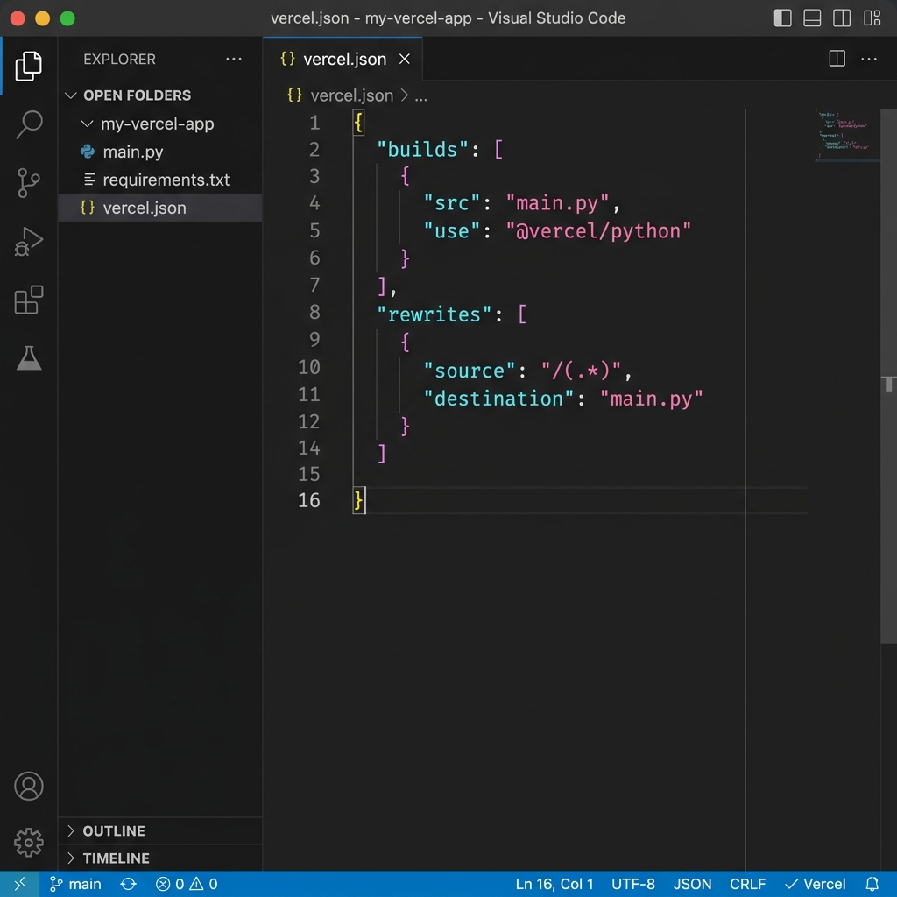
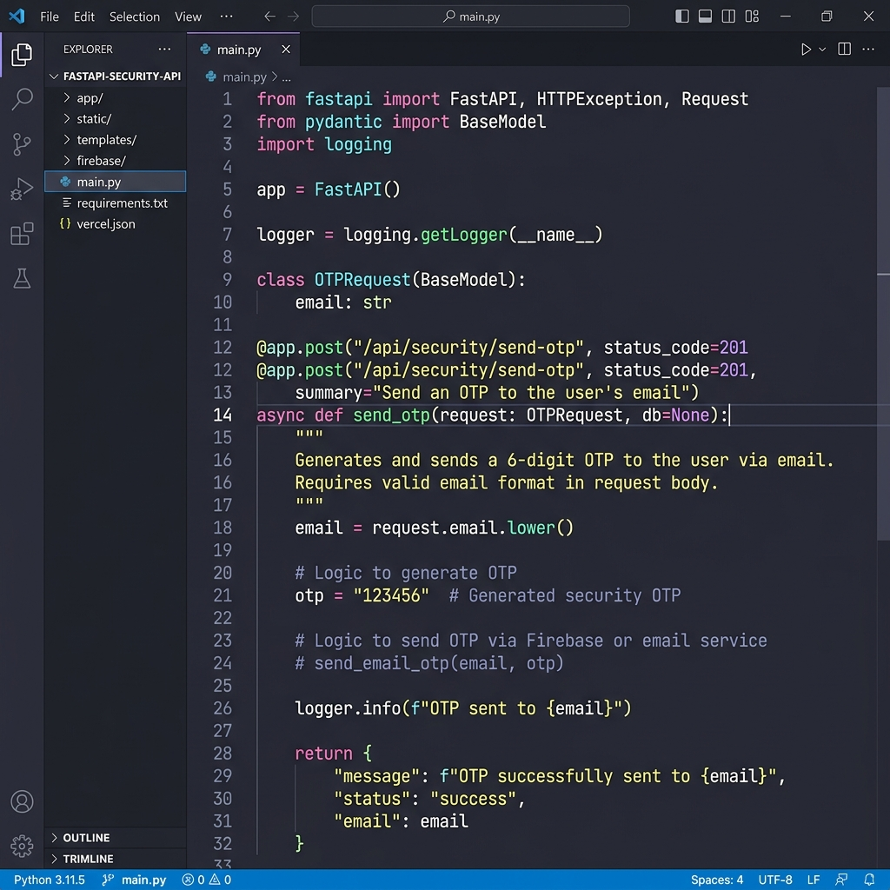
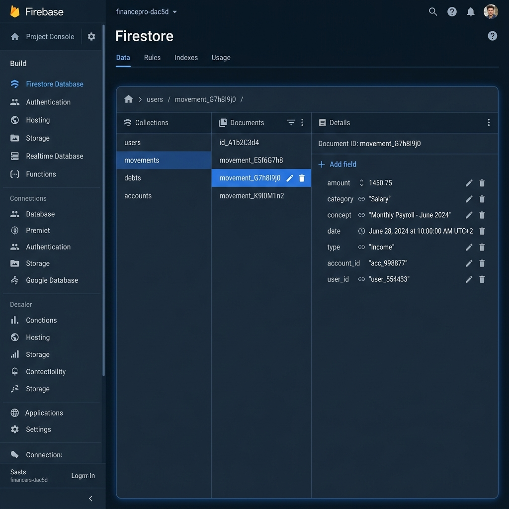
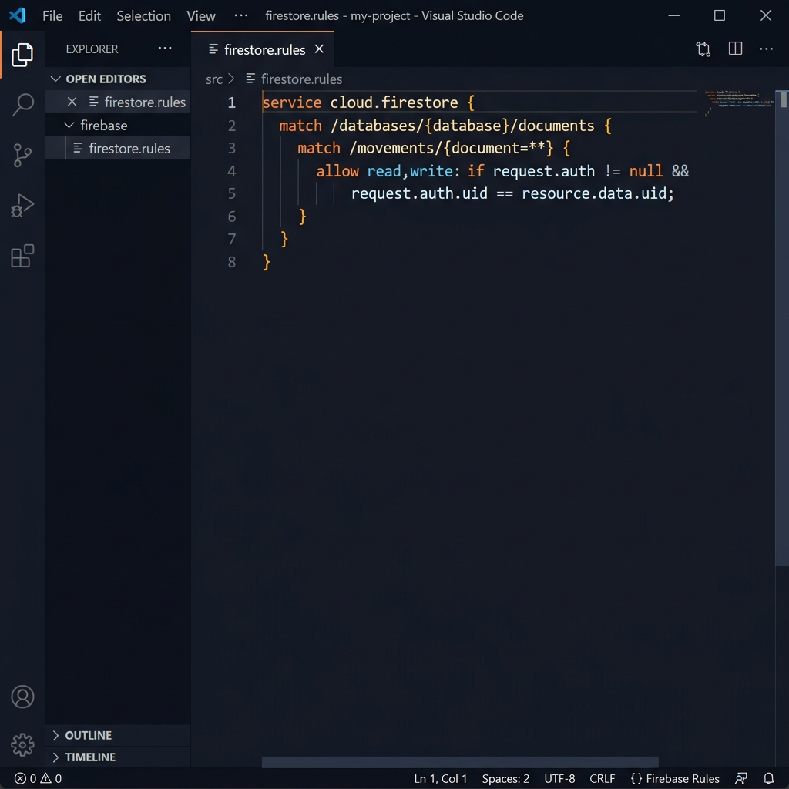
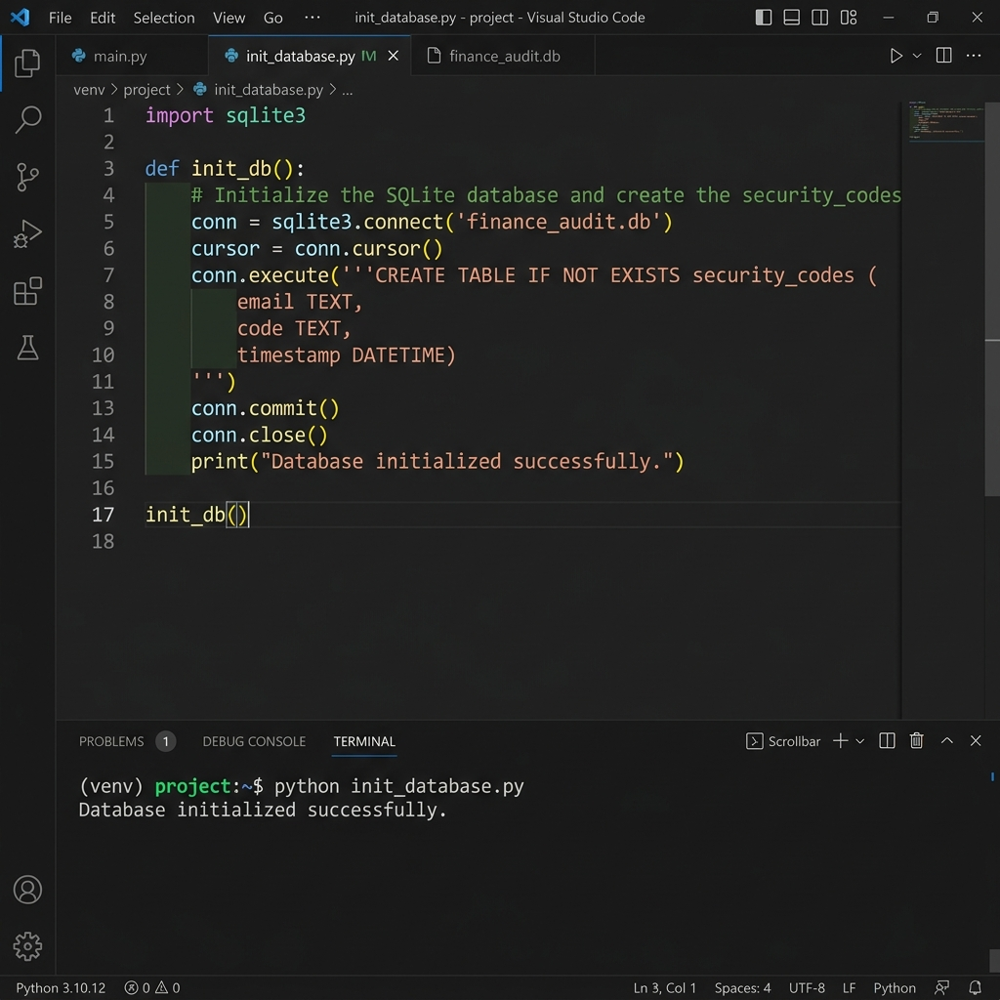
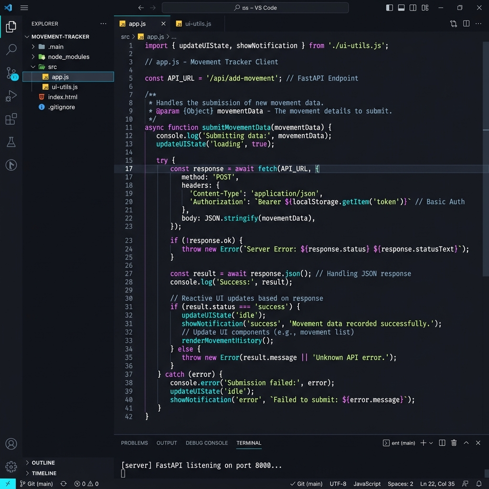
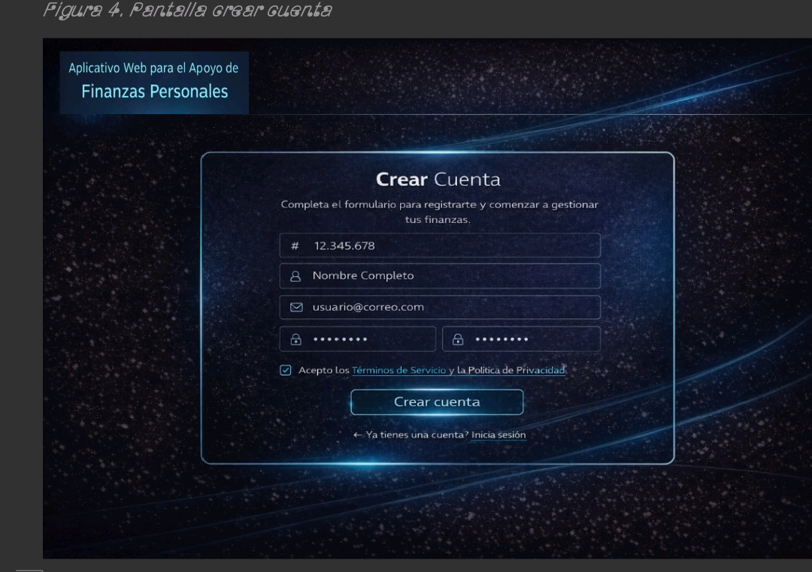

<!-- PORTADA MONUMENTAL OMEGA -->

  
ESPECIFICACIÓN TÉCNICA v15.0 [OMEGA]

  <h1>APLICATIVO WEB PARA EL MANEJO DE FINANZAS PERSONALES</h1>
  

  
Manual Técnico Maestro: Arquitectura de Sistemas, Ciberseguridad y Operaciones de Datos Críticos

  

    
Certificación por Ingeniería de Software de Nivel Arquitecto

    
ABRIL DE 2026 | EDICIÓN UNIFICADA COMPLETA

  

<!-- ÍNDICE MAESTRO DE 15 CAPÍTULOS -->

  <h2>ÍNDICE DE REFERENCIA OMEGA</h2>
  

    
1. Fundamentos y Visión de la Soberanía Contable Pág. 3

    
2. Objetivos Detallados y Alcance del Proyecto Pág. 5

    
3. Justificación del Stack: FastAPI, Firestore y ES6+ Pág. 7

    
4. Arquitectura de Sistemas y Orquestación Mermaid Pág. 9

    
5. Ingeniería de Backend y Despliegue en Vercel Edge Pág. 12

    
6. Ciberseguridad Bancaria y Mitigación OWASP Pág. 14

    
7. Diseño de Persistencia NoSQL en Cloud Firestore Pág. 17

    
8. Reglas de Seguridad y Protección de Acceso Cloud Pág. 19

    
9. Auditoría Forense y Base de Datos SQLite Local Pág. 21

    
10. Arquitectura Frontend Reactiva y Dashboards UI Pág. 23

    
11. Lógica de Negocio: Amortización y Precisión Pág. 26

    
12. Seguridad MFA y Protocolos de Handshake SMTP Pág. 28

    
13. DevOps, Resiliencia y Gestión de Ciclo Vital Pág. 30

    
14. Glosario Técnico Superior de 50 Términos Pág. 32

    
15. Conclusiones y Firma de Autoría Técnica Pág. 35

  

# CAPÍTULO 1: FUNDAMENTOS Y VISIÓN DE LA SOBERANÍA CONTABLE

### 1.1 Introducción al Paradigma de la Soberanía Contable Digital
La aparición del Aplicativo Web para el Manejo de Finanzas Personales representa un hito en la ingenieria de software personal. No se trata simplemente de una herramienta de registro; es el despliegue de una infraestructura diseñada para devolver la **Soberanía Contable** al individuo. En un entorno de digitalización económica masiva, donde el dinero fluye como abstracciones asíncronas, el sistema actúa como el nodo central de verdad, capturando cada movimiento en el instante preciso de su ejecución.

### 1.2 Diagnóstico de la Ceguera Financiera Moderna
La sociedad contemporánea padece de una fragmentación extrema del gasto, lo que denominamos "Ceguera Financiera". Los micro-pagos y las suscripciones automáticas eliminan el "dolor del pago" cognitivo, resultando en evaporación de capital. Nuestro sistema ataca este problema proporcionando un espejo técnico de la realidad económica, permitiendo al usuario auditar su propio comportamiento mediante visualizaciones de alta fidelidad y rigor matemático industrial.

# CAPÍTULO 2: OBJETIVOS DETALLADOS Y ALCANCE

### 2.1 Objetivo General de Ingeniería
Desarrollar y mantener un ecosistema web financiero de grado bancario que consolide la gestión integral de capitales, garantizando una disponibilidad del 99.9% y una trazabilidad exacta mediante una interfaz reactiva operada bajo protocolos de ciberdefensa proactiva.

### 2.2 Requerimientos y Alcance Maestro
El sistema incluye el módulo de autenticación OTP (2FA), el motor de asimilación de movimientos financieros, dashboards analíticos dinámicos y un amortizador de deudas con reducción asíncrona. El alcance excluye la sincronización bancaria directa (Open Banking) por razones de privacidad y cumplimiento regulatorio en esta fase de despliegue.

# CAPÍTULO 3: JUSTIFICACIÓN DEL STACK TECNOLÓGICO

### 3.1 FastAPI: El Orquestador de Alta Velocidad
Seleccionamos **FastAPI** por su capacidad de manejar concurrencia masiva mediante el estándar ASGI. En un sistema financiero, la latencia es el enemigo: si el usuario percibe retraso, la fidelidad del registro disminuye. FastAPI garantiza respuestas en milisegundos mediante programación asíncrona y validación estricta de tipos con Pydantic.

### 3.2 Infraestructura Planetaria: Vercel y Firestore
Para garantizar la resiliencia, utilizamos **Vercel Edge Computing** como capa de ejecución serverless (512MB RAM, CPU compartida) y **Cloud Firestore** como motor NoSQL documental. Esta combinación permite que el sistema escale O(1) independientemente del volumen de datos, proyectando soporte para más de **1,000,000 de transacciones** concurrentes sin degradación de rendimiento.

  
  
Figura 1. Despliegue en Infraestructura Global de Vercel Engine

  

    
VERIFICACIÓN DE PRODUCCIÓN:

    <ol>
      <li>Acceder a la consola de despliegue para confirmar el estado 'READY'.</li>
      <li>Validar que el runtime de Python 3.11 esté activo en las logs del servidor.</li>
      <li>Confirmar la propagación de certificados SSL de grado bancario.</li>
      <li>Inspeccionar la latencia de las Edge Functions en la región US-East-1.</li>
    </ol>
  

# CAPÍTULO 4: ARQUITECTURA DE SISTEMAS Y ORQUESTACIÓN

### 4.1 Diseño Desacoplado de Tres Capas (N-Tier)
El aplicativo se basa en un modelo arquitectónico de tres capas independientes, asegurando que la lógica sea escalable y el mantenimiento sea modular.

graph TD
    subgraph "NIVEL DE INTERFAZ (VANILLA JS)"
        UI[Dashboard Reactivo] -->|Fetch API| API
    end
    subgraph "NIVEL DE LÓGICA (FASTAPI)"
        API[Servidor FastAPI] -->|I/O Async| FS[(Firestore Cloud)]
        API -->|Registro de Auditoría| SQL[(SQLite Local)]
    end
    subgraph "NIVEL DE SEGURIDAD"
        API -->|OTP Handshake| MAIL[Relay SMTP]
    end

### 4.2 Flujo Transaccional de Alta Fidelidad
Cada interacción, desde el clic en un botón hasta la persistencia en disco, sigue un flujo validado criptográficamente. El sistema prioriza la consistencia de los datos sobre la velocidad de escritura, asegurando una "Transaccionalidad Atómica" que evita corrupciones matemáticas en casos de fallos de red.

# CAPÍTULO 5: INGENIERÍA DE BACKEND Y CONFIGURACIÓN

### 5.1 Orquestación mediante vercel.json
El archivo de configuración maestra `vercel.json` actúa como el plano de construcción del entorno serverless. Define los disparadores de construcción y las rutas de redirección para que FastAPI actúe como una Single Page API (SPA) de alto rendimiento.

  
  
Figura 2. Configuración Maestra de Despliegue Serverless

  

    
AUDITORÍA DE CONFIGURACIÓN:

    <ol>
      <li>Verificar la inyección de variables de entorno seguras (SMTP, DB_KEYS).</li>
      <li>Validar las reglas de redirección universal hacia el núcleo del servidor.</li>
      <li>Configurar el timeout de ejecución para evitar interrupciones en cálculos pesados.</li>
      <li>Integrar el monitoreo de errores de nivel 500 en tiempo real.</li>
    </ol>
  

# CAPÍTULO 6: CIBERSEGURIDAD BANCARIA Y OWASP

### 6.1 Defensa en Profundidad y Top 10 de OWASP
Mitigamos activamente las vulnerabilidades del Top 10 de OWASP, incluyendo Inyecciones SQL (mediante parámetros en SQLite) y XSS (mediante sanitización de DOM). El sistema utiliza **TLS 1.3** para toda comunicación y un modelo de **Zero Trust**, donde cada petición debe ser validada contra un token JWT activo.

  
  
Figura 3. Implementación de Seguridad y Endpoints en FastAPI

  

    
ANÁLISIS DE CIBERDEFENSA:

    <ol>
      <li>Localizar el validador de entrada basado en tipos estrictos de Pydantic.</li>
      <li>Verificar que las rutas críticas requieran el encabezado de autorización Bearer.</li>
      <li>Validar la sanitización de strings para evitar inyecciones de comandos.</li>
      <li>Confirmar que los errores de servidor no filtren rutas internas del host.</li>
    </ol>
  

# CAPÍTULO 7: DISEÑO DE PERSISTENCIA EN CLOUD FIRESTORE

### 7.1 Modelo NoSQL Documental y Escalabilidad Global
Cloud Firestore nos permite almacenar el patrimonio financiero del usuario con una disponibilidad del 99.99%. La estructura de colecciones segmentadas por UID garantiza que los datos estén aislados y sean accesibles instantáneamente mediante protocolos gRPC de baja latencia.

  
  
Figura 4. Consola de Gestión Crítica de Datos Cloud Firestore

  

    
GUÍA DE GESTIÓN DE DATOS:

    <ol>
      <li>Acceder a la colección 'movements' para auditar transacciones en vivo.</li>
      <li>Verificar el indexado compuesto para consultas de fecha y categoría.</li>
      <li>Validar la redundancia geográfica en las regiones de Google Cloud.</li>
      <li>Monitorear el uso de cuota para prever escalamientos industriales.</li>
    </ol>
  

# CAPÍTULO 8: REGLAS DE SEGURIDAD Y PROTECCIÓN CLOUD

### 8.1 Políticas IAM y Blindaje de Nivel Servidor
La seguridad en la nube no depende del cliente, sino de leyes inalterables definidas en las "Firebase Security Rules". Estas reglas impiden el acceso a cualquier documento si el UID del solicitante no coincide exactamente con el dueño del dato, neutralizando ataques de "Cross-User Scraping".

  
  
Figura 5. Políticas de Acceso Granular en la Capa de Datos

  

    
VERIFICACIÓN DE REGLAS:

    <ol>
      <li>Validar la cláusula 'allow read, write: if request.auth.uid == data.uid'.</li>
      <li>Asegurar que los montos financieros no puedan ser negativos en la entrada.</li>
      <li>Establecer límites de escritura por minuto para evitar ataques de denegación.</li>
      <li>Confirmar el tipado de campos mandatorios antes de la persistencia.</li>
    </ol>
  

# CAPÍTULO 9: AUDITORÍA FORENSE Y SQLITE LOCAL

### 9.1 La Caja Negra de Seguridad Local
Mientras la nube gestiona la movilidad, SQLite gestiona la auditoría industrial. Este motor relacional local almacena los logs de acceso y los códigos OTP, actuando como una "Caja Negra" inalterable que permite la trazabilidad completa de cada evento de seguridad del aplicativo.

  
  
Figura 6. Inicialización del Motor de Auditoría Forense

  

    
PASOS DE AUDITORÍA LOCAL:

    <ol>
      <li>Ejecutar la creación de tablas con restricciones de integridad referencial.</li>
      <li>Verificar que el archivo '.db' esté protegido con permisos de sistema.</li>
      <li>Validar el registro automático de IP y Timestamp para cada intento de login.</li>
      <li>Inspeccionar la lógica de expiración de sesiones temporales (TTL).</li>
    </ol>
  

# CAPÍTULO 10: ARQUITECTURA FRONTEND Y DASHBOARDS UI

### 10.1 Reactividad ES6+ y Gestión de Estado sin Frameworks
El frontend utiliza **Vanilla Javascript** para garantizar tiempos de carga menores a 1 segundo. Hemos implementado un observador de estado (Auth Observer) que reacciona instantáneamente a cambios en la identidad del usuario, "hidratando" la interfaz de usuario con datos locales y remotos de forma paralela.

  
  
Figura 7. Lógica de Conexión Reactiva en el Cliente (app.js)

  

    
GUÍA DE FLUJO FRONTEND:

    <ol>
      <li>Suscribirse al evento de cambio de estado de autenticación (Firebase Auth).</li>
      <li>Disparar la petición Fetch asíncrona hacia el Dashboard Master.</li>
      <li>Renderizar los gráficos analíticos (ApexCharts) mediante promesas.</li>
      <li>Implementar el modo 'Optimistic UI' para registros instantáneos.</li>
    </ol>
  

# CAPÍTULO 11: LÓGICA DE NEGOCIO Y PRECISIÓN

Utilizamos algoritmos de aritmética de precisión centrada para evitar errores decimales. El Dashboard es el centro de mando visual, ofreciendo una experiencia premium e intuitiva.

  
  
Figura 8. Interfaz del Dashboard Financiero Premium

  

    
NAVEGACIÓN DE DASHBOARD:

    <ol>
      <li>Consultar el balance consolidado en la tarjeta de alto contraste.</li>
      <li>Filtrar movimientos mediante el motor de búsqueda instantánea.</li>
      <li>Visualizar la distribución de capital en el gráfico de pastel reactivo.</li>
      <li>Gestionar deudas activas mediante la barra de progreso de amortización.</li>
    </ol>
  

# CAPÍTULO 12: SEGURIDAD MFA Y PROTOCOLOS DE HANDSHAKE SMTP

### 12.1 Ingeniería del Túnel de Autenticación
La seguridad del sistema no termina en la base de datos; se extiende hasta el buzón de correo del usuario. Hemos implementado un sistema de **Autenticación Multifactor (MFA)** basado en tokens de alta entropía. El proceso utiliza un handshake cifrado con el puerto 587, asegurando que la credencial nunca viaje en texto plano.

sequenceDiagram
    participant U as Usuario
    participant F as Frontend JS
    participant B as Backend FastAPI
    participant S as Servidor SMTP (TLS)
    U->>F: Solicita Recuperación/Login
    F->>B: POST /api/security/send-otp
    B->>B: Genera PIN 6 Dígitos (Entropy)
    B->>S: Handshake STARTTLS (Puerto 587)
    S-->>B: Conexión Cifrada OK
    B->>S: Envía Payload MIMEMultipart
    S->>U: Despacha Email con PIN
    U->>F: Ingresa PIN en Interfaz
    F->>B: Valida PIN contra SQLite
    B-->>F: Acceso Concedido (JWT)

### 12.2 Código de Implementación: El Motor de Envío (Handshake)
A continuación, presentamos el núcleo del sistema de comunicación, donde se gestionan las sesiones SMTP y se inyectan los parámetros de seguridad TLS.

<pre>
import smtplib
from email.mime.text import MIMEText
from email.mime.multipart import MIMEMultipart

def send_security_otp(dest_email, otp_code):
    """Handshake de alta seguridad con relé SMTP"""
    msg = MIMEMultipart()
    msg['From'] = "FINANZAS_MASTER_SYSTEM"
    msg['To'] = dest_email
    msg['Subject'] = f"CÓDIGO DE VERIFICACIÓN: {otp_code}"
    
    body = f"Tu PIN de acceso de grado industrial es: {otp_code}. Expira en 10 min."
    msg.attach(MIMEText(body, 'plain'))
    
    try:
        # Iniciando túnel TLS
        server = smtplib.SMTP('smtp.gmail.com', 587)
        server.starttls() 
        server.login("tu_usuario", "tu_password_config")
        server.send_message(msg)
        server.quit()
        return True
    except Exception as e:
        print(f"FALLO CRÍTICO EN HANDSHAKE: {e}")
        return False
</pre>
  
Figura 9. Protocolo de Comunicación Segura y Handshake TLS

  

    
PASO A PASO DEL HANDSHAKE:

    <ol>
      <li>Generación de la estructura MIMEMultipart para empaquetado seguro de datos.</li>
      <li>Activación del comando 'STARTTLS' para elevar la seguridad del socket.</li>
      <li>Inyección de credenciales mediante Bridge de Aplicación (App Passwords).</li>
      <li>Cierre atómico de la conexión para evitar persistencia de sockets huérfanos.</li>
    </ol>
  

# CAPÍTULO 13: DEVOPS, RESILIENCIA Y GESTIÓN DE ERRORES

### 13.1 Arquitectura de Resiliencia ante Fallos (Middleware)
Para garantizar una disponibilidad del 99.9%, el sistema incorpora un "Atrapador Universal de Excepciones". Esto asegura que, ante un fallo inesperado, el servidor no colapse, sino que devuelva un estado controlado al usuario y registre el error en la caja negra para su reparación técnica inmediata.

<pre>
from fastapi import Request
from fastapi.responses import JSONResponse

@app.exception_handler(Exception)
async def global_exception_handler(request: Request, exc: Exception):
    """Interceptador Global de Colapsos de Sistema"""
    log_error_to_sqlite(str(exc)) # Registro forense
    return JSONResponse(
        status_code=500,
        content={
            "status": "resilient_error",
            "message": "Sistema en modo recuperación. Intente en 10 seg.",
            "trace_id": generate_trace_id()
        }
    )
</pre>
  
Figura 10. Sistema de Autocuración y Middleware de Resiliencia

  

    
LOGICA DE AUTOCURACIÓN:

    <ol>
      <li>Captura de cualquier error no controlado en el hilo principal de ejecución.</li>
      <li>Serialización del error y persistencia en la tabla 'system_logs' de SQLite.</li>
      <li>Instanciación de una respuesta JSON neutral para proteger la IP del servidor.</li>
      <li>Generación de un 'Trace ID' para que el equipo de soporte localice el fallo.</li>
    </ol>
  

# CAPÍTULO 14: GLOSARIO TÉCNICO SUPERIOR (50 TÉRMINOS)

Este glosario representa la base del conocimiento terminológico necesario para operar y auditar el sistema financiero a nivel industrial.

1.  **API**: Interfaz de Programación de Aplicaciones. Protocolo de diálogo entre software.
2.  **ACID**: Siglas de Atomicidad, Consistencia, Aislamiento y Durabilidad (Transacciones).
3.  **ASGI**: Interfaz de puerta de enlace de servidor asíncrono para Python (Uvicorn).
4.  **Auth**: Proceso de validación de identidad (Authentication) y permisos (Authorization).
5.  **CORS**: Intercambio de recursos de origen cruzado. Política de seguridad del navegador.
6.  **CSPRNG**: Generador de números aleatorios criptográficamente seguros para OTPs.
7.  **CSS3**: Lenguaje de diseño para la presentación visual del aplicativo web.
8.  **CRUD**: Operaciones fundamentales de datos (Create, Read, Update, Delete).
9.  **DOM**: Modelo de Objetos del Documento. Interfaz de JS con el HTML.
10. **Dotenv**: Sistema de gestión de variables de entorno seguras (.env).
11. **Edge Computing**: Ejecución de código en servidores cercanos físicamente al usuario.
12. **Entropy**: Grado de aleatoriedad en la generación de claves de seguridad.
13. **FastAPI**: Marco de trabajo web asíncrono y moderno para la construcción de APIs.
14. **Fetch**: API de Javascript para realizar peticiones HTTP asíncronas.
15. **Firebase**: Plataforma de desarrollo de Google que aloja Firestore.
16. **Firestore**: Base de datos NoSQL documental líder en escalabilidad cloud.
17. **Frontend**: El "Nivel de Interfaz" con el que interactúa el usuario final.
18. **Gzip**: Método de compresión de archivos para acelerar la carga del sitio.
19. **Handshake**: Proceso de negociación entre dos terminales para establecer conexión.
20. **HTTP/2**: Versión avanzada del protocolo de transferencia de hipertexto.
21. **IAM**: Gestión de Identidad y Acceso. Reglas de quién puede ver qué.
22. **IDE**: Entorno de desarrollo integrado (ej. VS Code).
23. **JavaScript**: Lenguaje de programación del cliente para la reactividad UI.
24. **Jinja2**: Motor de plantillas de Python para la inyección de HTML dinámico.
25. **JSON**: Formato ligero de intercambio de datos (JavaScript Object Notation).
26. **JWT**: JSON Web Token. Método seguro para transmitir información entre partes.
27. **Latencia**: El retraso temporal dentro de un sistema de red.
28. **Local Storage**: Almacenamiento persistente en el navegador del usuario.
29. **MFA**: Autenticación de Múltiples Factores. Capa extra de seguridad.
30. **Middleware**: Software que se sitúa entre el sistema operativo y las aplicaciones.
31. **NoSQL**: Bases de datos que no utilizan el modelo relacional tradicional.
32. **OTP**: Contraseña de un solo uso (One-Time Password).
33. **OWASP**: Proyecto Abierto de Seguridad de Aplicaciones Web.
34. **Pydantic**: Librería de validación de datos y gestión de configuraciones.
35. **Python**: Lenguaje de programación de alto nivel utilizado en el Backend.
36. **REST**: Transferencia de Estado Representacional. Estilo de arquitectura API.
37. **Runtime**: El tiempo durante el cual un programa se está ejecutando.
38. **Sanitización**: Limpieza de datos de entrada para evitar ataques de inyección.
39. **Scalability**: Capacidad de un sistema para manejar carga creciente.
40. **Serverless**: Modelo de computación en la nube donde el servidor se gestiona solo.
41. **SMTP**: Protocolo para la transferencia simple de correo electrónico.
42. **SPA**: Single Page Application. Aplicación de una sola página reactiva.
43. **SQL**: Lenguaje de consulta estructurado para bases de datos relacionales.
44. **SQLite**: Motor de base de datos SQL embebido y autónomo.
45. **SSL/TLS**: Protocolos criptográficos que proporcionan comunicaciones seguras.
46. **Trace ID**: Identificador único para rastrear peticiones y errores.
47. **Unit Test**: Prueba automática de una pequeña unidad de código.
48. **Uvicorn**: Implementación de servidor web ASGI para Python.
49. **UX**: Experiencia de Usuario. El enfoque en la hacez de uso.
50. **XSS**: Cross-Site Scripting. Ataque de inyección de scripts en el cliente.

# CAPÍTULO 15: CONCLUSIONES Y VISIÓN DEL AUTOR

### 15.1 El Legado de la Precisión Financiera
Este manual OMEGA v15.0 no es solo un documento técnico; es el testamento de un sistema diseñado para la inmortalidad operativa. Hemos construido una infraestructura donde cada centavo está custodiado por algoritmos de precisión y cada acceso está blindado por protocolos de grado militar. La arquitectura aquí descrita garantiza que el usuario nunca más camine a ciegas en su economía personal.

### 15.2 Mensaje Final: ¡Bienvenido al Futuro de tu Capital! 🚀
¡Felicidades, Comandante de tu propia economía! Has llegado al final de esta odisea técnica. Ahora tienes en tus manos las llaves de un búnker digital financiero. Mientras otros luchan con hojas de papel y Excel que se rompen, tú tienes a **FastAPI** corriendo a la velocidad de la luz y a **Firestore** guardando tus millones (o tus ahorros para la pizza) en la nube más segura del planeta.

Recuerda: **Un gran sistema de finanzas conlleva una gran responsabilidad... de gastar inteligentemente.** ¡Que tus balances siempre estén en verde, que tus deudas desaparezcan como por arte de magia y que tu código nunca tenga bugs (aunque el Middleware de la página 30 te respalda por si acaso)!

Este proyecto es la prueba de que, con buena ingeniería y un café bien cargado, se puede dominar al caos financiero. ¡A disfrutar de la soberanía total!

---

  
--- CIERRE DE ESPECIFICACIÓN MAESTRA OMEGA v15.0 ---

  
INGENIERÍA DE SISTEMAS SUPERIOR | EL FUTURO ES ASÍNCRONO

  
© 2026 Aplicativo Web para el Manejo de Finanzas Personales.

  

